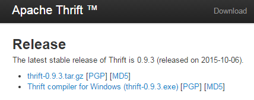
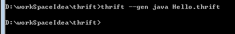
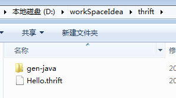
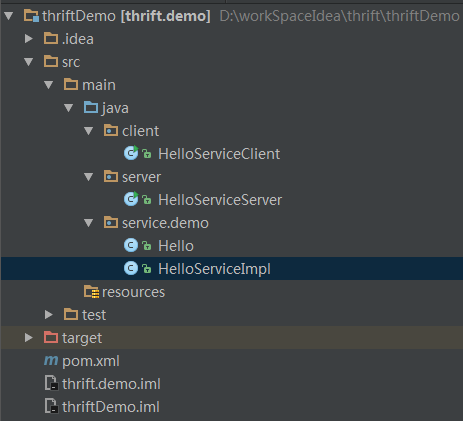
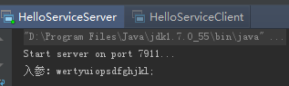
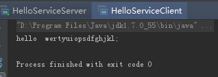


> author : 快乐崇拜
email :   852026881@qq.com


# 下载安装
- 到官网下载Windows版本的编译器：

http://thrift.apache.org/download

 

- 下载完成后放到【C:\Program Files\Thrift】目录下，并将名字改为【thrift.exe】。注：这里改名只是为了敲命令行方便
- 将目录【C:\Program Files\Thrift】添加到环境变量即可


# 编写helloword服务接口描述文件代码

```java
namespace java service.demo
service Hello{
    string helloString(1:string para)
    i32 helloInt(1:i32 para)
    bool helloBoolean(1:bool para)
    void helloVoid()
    string helloNull()
}
```


**命名为【Hello.thrift】放到【D:\workSpaceIdea\thrift】目录下，执行命令【thrift --gen java Hello.thrift】生成java文件：**





# 创建第一个thrift程序
### 创建一个maven项目
目录结构：


### pom 文件：
```xml
<?xml version="1.0" encoding="UTF-8"?>
<project xmlns="http://maven.apache.org/POM/4.0.0"
         xmlns:xsi="http://www.w3.org/2001/XMLSchema-instance"
         xsi:schemaLocation="http://maven.apache.org/POM/4.0.0 http://maven.apache.org/xsd/maven-4.0.0.xsd">
    <modelVersion>4.0.0</modelVersion>

    <groupId>com.lbl</groupId>
    <artifactId>thrift.demo</artifactId>
    <version>1.0-SNAPSHOT</version>

    <dependencies>
        <dependency>
            <groupId>org.apache.thrift</groupId>
            <artifactId>libthrift</artifactId>
            <version>0.9.3</version>
        </dependency>
        <!-- https://mvnrepository.com/artifact/org.slf4j/slf4j-log4j12 -->
        <dependency>
            <groupId>org.slf4j</groupId>
            <artifactId>slf4j-log4j12</artifactId>
            <version>1.7.12</version>
        </dependency>

        <dependency>
            <groupId>junit</groupId>
            <artifactId>junit</artifactId>
            <version>4.11</version>
            <scope>test</scope>
        </dependency>
    </dependencies>

</project>
```
### Hello.java是通过thrift自动生成的
 
 
 # 运行结果：
 - 运行server以后，运行client，会在server的console控制台看到输出内容
 
 


# 注意
- `客户端和服务端要使用同一中 Protocol 和 Transport，否则会抛出异常`


